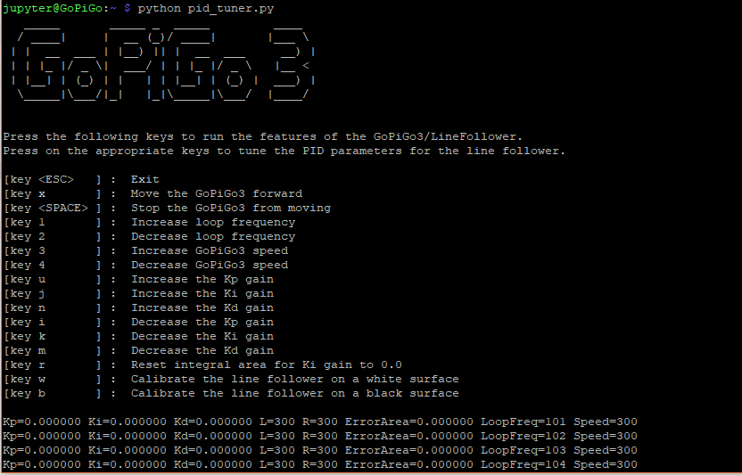

## PID-based Controller for the Line Follower

This is a project you can use to tune your GoPiGo + Black/Line Line Follower to follow a black/white line.

It all starts with the sensor of your choice: be it the old line follower (the red one) or the new one,
which has a much higher poll rate, the sensors are more accurate and reliable, has a reduced power consumption and has a smaller footprint. 

### The Black Line Follower

### The Red Line Follower

To find out more on interfacing with either sensor, check out the DI_Sensors [documentation](https://di-sensors.readthedocs.org).

### Optimal Values for Each Line Follower

#### The Black Line Follower

For the black line follower, the following parameters work best for the GoPiGo3:

1. Base Speed = 300
1. Loop Frequency = 100
1. Kp = 1100
1. Ki = 0
1. Kd = 1300

#### The Red Line Follower

For the red line follower, the following parameters work best for the GoPiGo3:

1. Base Speed = 300
1. Loop Frequency = 30
1. Kp = 4200
1. Ki = 0
1. Kd = 2500

#### Running the Program

To run the program, first be sure to have installed both the GoPiGo3 and DI_Sensors libraries and then
run `python pid_controller.py` to run the program.

Make use of the 2 available commands (`w` and `b`) in the menu to calibrate each line follower on a white and black surface.

Next, update the Kp/Ki/Kd gains accordingly by using the appropriate commands listed in the menu and then finally let the GoPiGo3 run freely.

_Note: Pay attention to the maximum update rate of both line followers: the black line follower updates at a maximum rate of ~130Hz with the poll rate going up to ~500Hz whilst the red line follower can do ~50Hz at most (both the update & poll rate)._