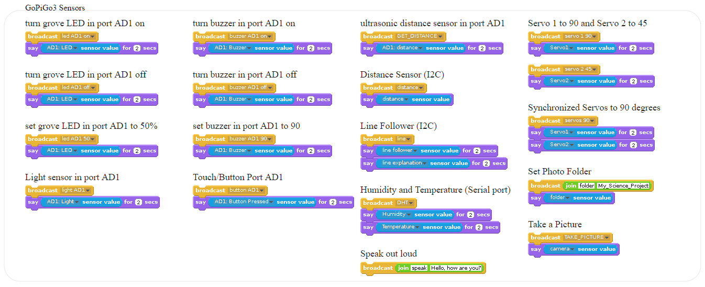

# Program the GoPiGo in Scratch

You can program the GoPiGo3 with Scratch 1.4.  This repo contains support programs and example programs to help you program the [GoPiGo3](http://www.dexterindustries.com/GoPiGo3) in Scratch.

The GoPiGo3 is a delightful and complete robot for the Raspberry Pi that turns your Pi into a fully operating robot.  GoPiGo3 is a mobile robotic platform for the Raspberry Pi developed by [Dexter Industries.](http://www.dexterindustries.com/GoPiGo3).

## Sensor Placement
You can add a number of Grove sensors to the GoPiGo3.  Sensors must be placed in the correct port to work.

 	
| Sensor | Port |
| ------------- | ------------- |
| Ultrasonic Distance Sensor | AD1 or AD2 |
| Button | AD1 or AD2 |
| Buzzer | AD1 or AD2 |
| LED | AD1 or AD2 |
| DHT Sensor | Serial |

Dexter Industries also provide a growing number of sensors for the GoPiGo3

| Sensor | Port |
| ------------- | ------------- |
| Line Sensor | I2C |
| Dexter Distance Sensor | I2C |

## Getting Started Examples
Please see our Examples folder for examples on how to get started with programming the GoPiGo3 in Scratch!

Here are a list of commands.
GoPiGo3 controls:

GoPiGo3 LEDs:

GoPiGo3 Sensors:

GoPiGo3 Add-Ons:

GoPiGo3 Deprecated Sensors:

## See Also

- [Dexter Industries] (http://www.dexterindustries.com/GoPiGo3)
- [Kickstarter Campaign] (http://kck.st/Q6vVOP)
- [Raspberry Pi] (http://www.raspberrypi.org/)

This repository contains source code, firmware and design materials for the GoPiGo3.

## License
GoPiGo3 for the Raspberry Pi: an open source robotics platform for the Raspberry Pi.
Copyright (C) 2017  Dexter Industries

This program is free software: you can redistribute it and/or modify
it under the terms of the GNU General Public License as published by
the Free Software Foundation, either version 3 of the License, or
(at your option) any later version.

This program is distributed in the hope that it will be useful,
but WITHOUT ANY WARRANTY; without even the implied warranty of
MERCHANTABILITY or FITNESS FOR A PARTICULAR PURPOSE.  See the
GNU General Public License for more details.

You should have received a copy of the GNU General Public License
along with this program.  If not, see <http://www.gnu.org/licenses/gpl-3.0.txt>.
