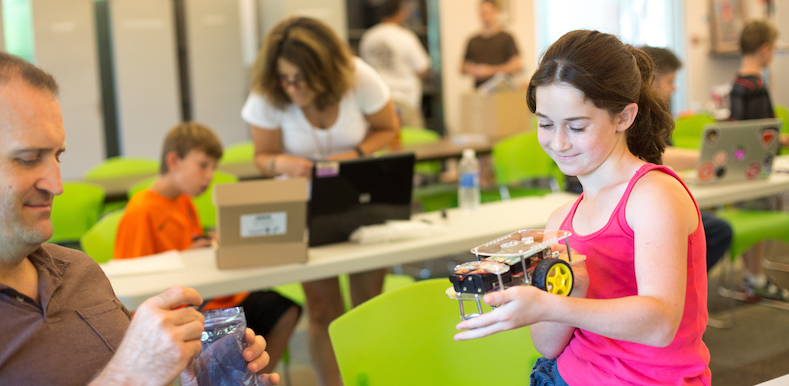
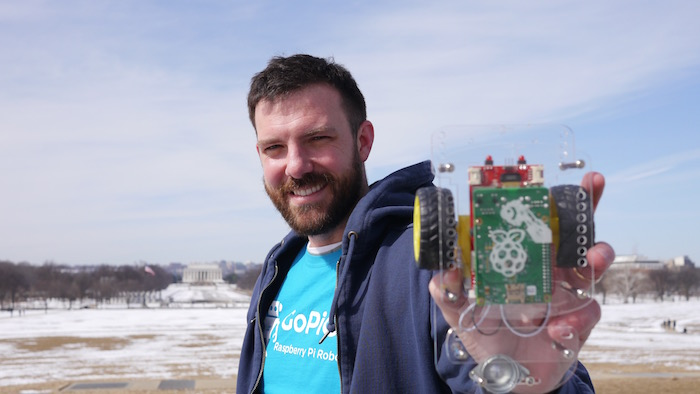
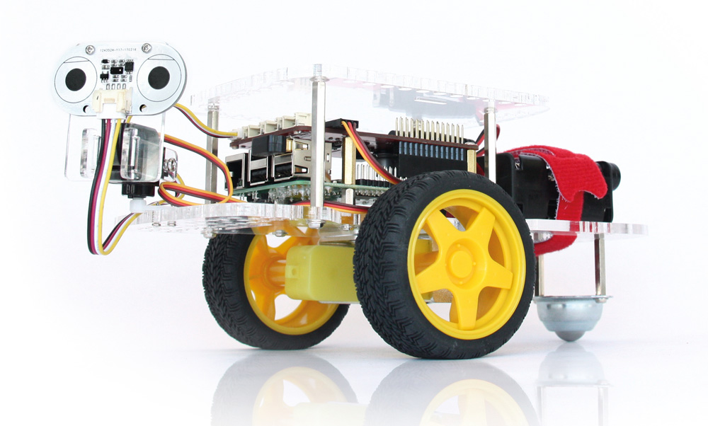

.. _about-chapter:

########
About Us
########

**************************
Who are we and what we do.
**************************

.. image:: images/dexter-logo.jpg
   :scale: 100

`Dexter Industries`_ is an American educational robotics company that develops robot kits that make programming accessible for everyone.

`Dexter Industries`_ was founded in 2010 by John Cole.  Like most great companies, it started on a kitchen table where kits and products were hand designed, hand assembled, and shipped to our customers.   After a few years of developing sensors for LEGO Mindstorms, he came up with the idea to connect LEGO Mindstorms with the Raspberry Pi single board computer. The idea was launched as a Kickstarter Project called the BrickPi and turned out to be quite successful.  We’ve been building robots for the Raspberry Pi ever since!

Originally focused on hobbyists, hackers, engineers and makers, we soon found out that our kits were being used in classrooms all around the world to teach students computer science, electrical engineering and robotics. We’re now dedicated to building better content — from manuals and projects to curriculums and teachers’ notes, to make building, learning and teaching more accessible and fun for everyone.

***************************
Our motto "Learn by doing."
***************************

Here at `Dexter Industries`_, we’ve all personally experienced how much better we understand computer science concepts and programming when we see it do something tangible in the physical world. Real learning happens when mistakes are made, and the best engineers are those that can figure out how to solve real problems.

We believe robots are the best way to do this. Rather than just seeing an error on your screen when your code is wrong, your robot might run into a wall while the wheels keep spinning, or you might see the red LED go on when you meant to turn the green one on. Physical reactions that indicate problems engage people in a multi-dimensional way, to improve retention, deepen understanding and promote curiosity.

We’re devoted to building great products to help everyone learn how to become a problem solver. Not everything that you make is important, but the process of making can improve your ability to build stuff that is important someday. Our goal is to enable you to make stuff that matters.

***********************
The Founder, John Cole.
***********************

Founder & CEO of `Dexter Industries`_, John Cole, was inspired by the many engineers in his family.  Always tinkering and making, he decided at a young age to become a scientist. He spent his childhood in Northern Virginia, but hasn’t spent much time in one place since then. After graduating from George Washington University with a degree in Physics & Chemistry, he worked as a petroleum engineer in Louisiana.

Afterwards, he spent time in New York getting his Masters in Chemical Engineering from Columbia. From there he launched a biodiesel startup, worked for the State Department in East Baghdad, moved to Mexico City, followed by a stint in Afghanistan working for USAID, a few years in India, bounced back to D.C. and now, is based in Dubai with his wife and son.

********************************
What's this documentation about.
********************************

This documentation is all about the `GoPiGo3`_ robot.
Within this, you will find instructions on:

   * How to get started with the `GoPiGo3`_ robot - assembling, setting up the environment, etc.
   * How to operate the `GoPiGo3`_ with our API. The user has a comprehensive documentation of all the modules/functions/classes that are needed for controlling the robot.
   * How to troubleshoot the `GoPiGo3`_ in case of unsuspected situations.

.. _gopigo3: https://www.dexterindustries.com/shop/gopigo-advanced-starter-kit/
.. _dexter industries: https://www.dexterindustries.com
