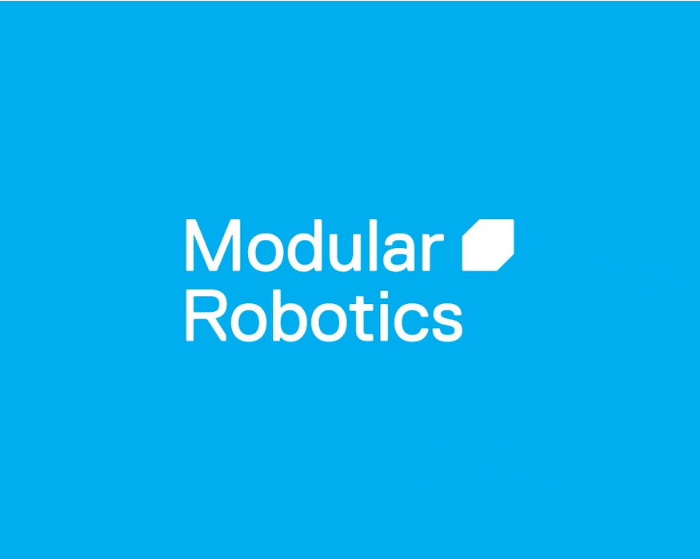

.. _about-chapter:

#############
About GoPiGo3
#############

**************************
Who are we and what we do.
**************************

`Modular Robotics`_ started as a spin-off from Carnegie Mellon University, where founder Eric Schweikardt invented Cubelets_ while working on a PhD. After years of research and development, Cubelets robot blocks were released to the public in 2010. Funding came from National Science Foundation grants and venture capital from the Foundry Group. This began our work of trying to make the world a better place with thousands and thousands of tiny robots.
In 2019, we added to our product line when we acquired Dexter Industries, the original creators of the GoPiGo.

********************************
What's this documentation about.
********************************

This documentation is all about the `GoPiGo3`_ robot.
Within this, you will find instructions on:

   * How to get started with the `GoPiGo3`_ robot - assembling, setting up the environment, etc.
   * How to get started with the example programs found in our repo.
   * How to operate the `GoPiGo3`_ with our API. The user has a comprehensive documentation of all the modules/functions/classes that are needed for controlling the robot.
   * How to troubleshoot the `GoPiGo3`_ in case of unsuspected situations.

.. image:: images/gopigo3.jpg

.. _gopigo3: https://gopigo.io/
.. _Modular Robotics: https://www.modrobotics.com
.. _Cubelets: https://www.modrobotics.com
