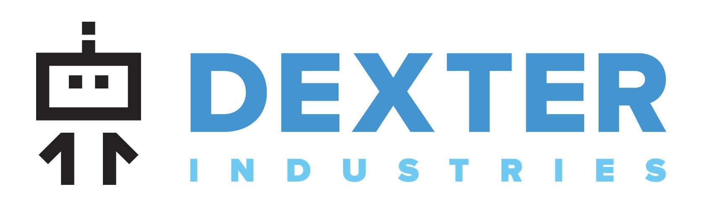

.. _about-chapter:

#############
About GoPiGo3
#############

**************************
Who are we and what we do.
**************************

`Dexter Industries`_ is an American educational robotics company that develops robot kits that make programming accessible for everyone.

********************************
What's this documentation about.
********************************

This documentation is all about the `GoPiGo3`_ robot.
Within this, you will find instructions on:

   * How to get started with the `GoPiGo3`_ robot - assembling, setting up the environment, etc.
   * How to get started with the example programs found in our repo.
   * How to operate the `GoPiGo3`_ with our API. The user has a comprehensive documentation of all the modules/functions/classes that are needed for controlling the robot.
   * How to troubleshoot the `GoPiGo3`_ in case of unsuspected situations.

.. image:: images/gopigo3.jpg

.. _gopigo3: https://www.dexterindustries.com/shop/gopigo-advanced-starter-kit/
.. _dexter industries: https://www.dexterindustries.com
