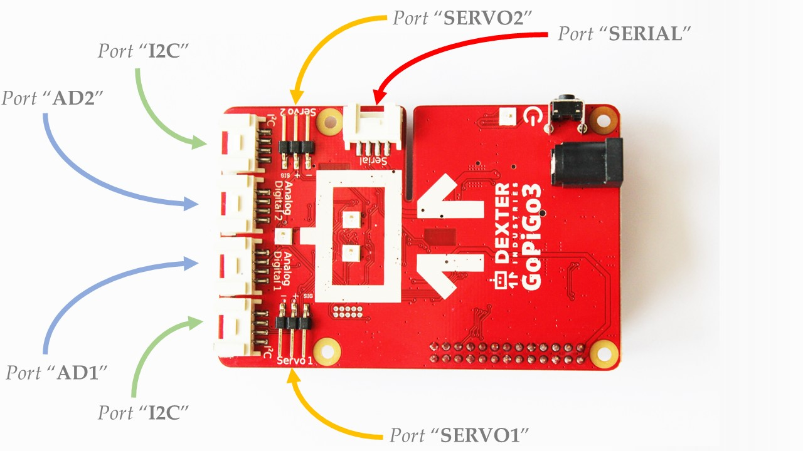

.. _api-basic-chapter:

###########################
API Reference Point - Basic
###########################

============
Requirements
============

Before using this chapter's classes, you need to be able to import the following module.

.. code-block:: python

   import easygopigo3

If you have issues importing these 2 modules, then make sure that:

   * You've followed the steps found in :ref:`Getting Started <getting-started-chapter>` guide.
   * You have installed either `Raspbian For Robots`_, the GoPiGo3 `repository`_ or the `GoPiGo3 package`_ (the pip package).
   * You have the ``gopigo3`` package installed by typing the command ``pip freeze | grep gopigo3`` on your Raspberry Pi's terminal. If the package is installed, then a string with the ``GoPiGo3==[x.y.z]`` format will show up.

If you encounter issues that aren't covered by our :ref:`Getting Started <getting-started-chapter>` guide or :ref:`FAQ <faq-chapter>` chapter, please head over to our `forum`_.

.. _hardware-ports-section:

=====================================
Hardware Ports
=====================================

In this graphical representation, the `GoPiGo3`_ board has the following ports available for use.
The quoted literals are to be used as pin identifiers inside the python scripts.

These ports have the following functionalities:

   * Ports ``"AD1"`` and ``"AD2"`` - general purpose input/output ports.
   * Ports ``"SERVO1"`` and ``"SERVO2"`` - servo controller ports.
   * Ports ``"I2C"`` - ports to which you can connect I2C-enabled devices.
   * Port ``"SERIAL"`` - port to which you can connect UART-enabled device.

.. note::

   Use the quoted port names when referencing them inside a python script like in the following example.

   .. code-block:: python

      # we need an EasyGoPiGo3 object for instantiating sensor / actuator objects
      gpg3_obj = EasyGoPiGo3()

      # we're using the quoted port names from the above graphical representation

      # here's a LightSensor object binded on port AD2
      light_obj = gpg3_obj.init_light_sensor("AD2")

      # here's a UltraSonicSensor object binded on port AD1
      us_obj = gpg3_obj.init_ultrasonic_sensor("AD1")

      # here's a LineFollower object binded on port I2C
      line_follower_obj = gpg3_obj.init_line_follower("I2C")

      # and so on

.. seealso::

   For more technical details on the `GoPiGo3`_ robot, please check our `technical specs`_ page.

=====================================
EasyGoPiGo3
=====================================

.. autoclass:: easygopigo3.EasyGoPiGo3
   :members:
   :special-members:

=====================================
LightSensor
=====================================

.. autoclass:: easygopigo3.LightSensor
   :members:
   :special-members:

=====================================
SoundSensor
=====================================

.. autoclass:: easygopigo3.SoundSensor
   :members:
   :special-members:

=====================================
UltrasonicSensor
=====================================

.. autoclass:: easygopigo3.UltraSonicSensor
   :members:
   :special-members:

=====================================
Buzzer
=====================================

.. autoclass:: easygopigo3.Buzzer
   :members:
   :special-members:

=====================================
Led
=====================================

.. autoclass:: easygopigo3.Led
   :members:
   :special-members:

=====================================
ButtonSensor
=====================================

.. autoclass:: easygopigo3.ButtonSensor
   :members:
   :special-members:

=====================================
LineFollower
=====================================

.. autoclass:: easygopigo3.LineFollower
   :members:
   :special-members:

=====================================
Servo
=====================================

.. autoclass:: easygopigo3.Servo
   :members:
   :special-members:

=====================================
DistanceSensor
=====================================

.. autoclass:: easygopigo3.DistanceSensor
   :members:
   :special-members:

=====================================
DHTSensor
=====================================

.. warning::

   Coming soon!

.. _distance sensor: https://www.dexterindustries.com/shop/distance-sensor/
.. _gopigo3: https://www.dexterindustries.com/shop/gopigo-advanced-starter-kit/
.. _shop: https://www.dexterindustries.com/shop/
.. _infrared receiver: https://www.seeedstudio.com/Grove-Infrared-Receiver-p-994.html
.. _technical specs: https://www.dexterindustries.com/GoPiGo/learning/hardware-port-description/
.. _grove light sensor: https://www.dexterindustries.com/shop/grove-light-sensor/
.. _grove sound sensor: https://www.dexterindustries.com/shop/grove-sound-sensor/
.. _grove ultrasonic sensor: https://www.dexterindustries.com/shop/ultrasonic-sensor/
.. _grove buzzer: https://www.dexterindustries.com/shop/grove-buzzer/
.. _grove led: https://www.dexterindustries.com/shop/grove-red-led/
.. _grove button: https://www.dexterindustries.com/shop/grove-button/
.. _servo: https://www.dexterindustries.com/shop/servo-package/
.. _line follower: https://www.dexterindustries.com/shop/line-follower-for-gopigo/
.. _gopigo3 package: https://pypi.python.org/pypi/gopigo3
.. _repository: https://www.dexterindustries.com/GoPiGo/get-started-with-the-gopigo3-raspberry-pi-robot/3-program-your-raspberry-pi-robot/python-programming-language/
.. _raspbian for robots: https://sourceforge.net/projects/dexterindustriesraspbianflavor/
