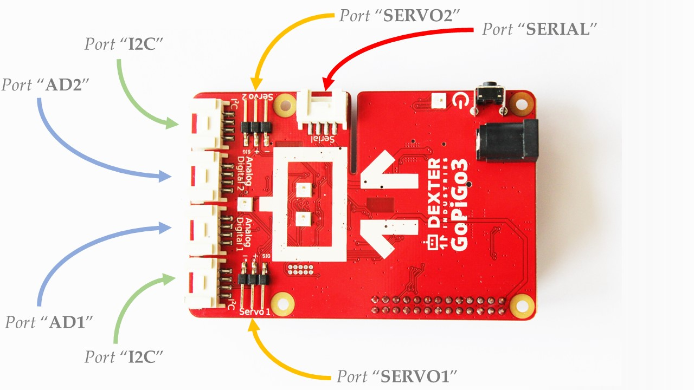

*************************************
About Library & Hardware
*************************************

=====================================
Requirements
=====================================

Before using this chapter's classes, you need to be able to import the following modules.

.. code-block:: python

   import easygopigo3
   import easysensors

If you have issues importing these two modules, then make sure:

   * You have followed the steps found in :ref:`Getting Started <getting-started-chapter>` guide.
   * You have installed either `Raspbian For Robots`_ or the GoPiGo3 `repository`_'s python package.
   * You have the ``gopigo3`` package installed by typing the command ``pip freeze | grep gopigo3`` on your Raspberry Pi's terminal. If the package is installed, then a string with the ``gopigo3==[x.y.z]`` format will show up.

If you encounter issues that aren't covered by our :ref:`Getting Started <getting-started-chapter>` guide or :ref:`FAQ <faq-chapter>` chapter, please head over to our `forum`_.

.. _hardware-ports-section:

=====================================
Hardware Ports
=====================================

In this graphical representation, the `GoPiGo3`_ board has the following ports available for use.
The quoted literals are to be used as pin identifiers inside the python scripts.

These ports have the following functionalities:

   * Ports ``"AD1"`` and ``"AD2"`` - general purpose input/output ports.
   * Ports ``"SERVO1"`` and ``"SERVO2"`` - servo controller ports.
   * Ports ``"I2C"`` - ports to which you can connect I2C-enabled devices.
   * Port ``"SERIAL"`` - port to which you can connect UART-enabled device.

.. note::

   Use the quoted port names when referencing them inside a python script like in the following example.

   .. code-block:: python

      # we need an EasyGoPiGo3 object for instantiating sensor / actuator objects
      gpg3_obj = EasyGoPiGo3()

      # we're using the quoted port names from the above graphical representation

      # here's a LightSensor object binded on port AD2
      light_obj = gpg3_obj.init_light_sensor("AD2")

      # here's a UltraSonicSensor object binded on port AD1
      us_obj = gpg3_obj.init_ultrasonic_sensor("AD1")

      # here's a LineFollower object binded on port I2C
      line_follower_obj = gpg3_obj.init_line_follower("I2C")

      # and so on

.. seealso::

   For more technical details on the `GoPiGo3`_ robot, please check our `technical specs`_ page.

=====================================
Library Structure
=====================================

-------------------------------------
Classes Short-List
-------------------------------------

Each of the following classes are organized in 3 modules: :py:mod:`gopigo3`, :py:mod:`easygopigo3` and :py:mod:`easysensors`.
Out of these 3 modules, we're only interested in :py:mod:`easygopigo3` and :py:mod:`easysensors` as :py:mod:`gopigo3` is meant for more advanced users.

.. note::

   The following graphic isn't just a photo (PNG, JPEG, etc), but it's an interactive graphic on which if you click on a class, you'll land
   on the documentation of a given class.

.. inheritance-diagram:: easysensors easygopigo3
   :parts: 2

For intializing :py:class:`~easysensors.Sensor`-derived objects, there are 2 ways to do it:

1. Either by using the ``init`` methods of the :py:class:`~easygopigo3.EasyGoPiGo3` class. This is the preffered way.
2. Or by using the constructor of each class (:py:class:`~easysensors.DHTSensor`, :py:class:`~easysensors.Led`, etc), which is harder because it also requires passing a :py:class:`~easygopigo3.EasyGoPiGo3` object for instantiation.

.. note::

   Class :py:class:`easysensors.AnalogSensor` does not only deal with sensors, but outputs as well like :py:class:`easysensors.Led` and :py:class:`easysensors.Buzzer`.
   While we agree this isn't the best name for this class, we're going to keep it this way due to compatibility reasons we don't want to break (for now).

-------------------------------------
Functions Short-List
-------------------------------------

Here's a short summary of the methods of all classes that are documented. We start off with a couple of lists for the methods/functions/methods of the :py:mod:`easygopigo3` module and then
we finish with another few for the :py:mod:`easysensors` module, so that we can create a visual distinction one from another and thus make it more easy to search around.

.. _gopigo3-movement-api-methods:

"""""""""""""""""""""""""""""""""""""
GoPiGo3 Movement
"""""""""""""""""""""""""""""""""""""

.. autosummary::
   easygopigo3.EasyGoPiGo3
   easygopigo3.EasyGoPiGo3.volt
   easygopigo3.EasyGoPiGo3.set_speed
   easygopigo3.EasyGoPiGo3.get_speed
   easygopigo3.EasyGoPiGo3.reset_speed
   easygopigo3.EasyGoPiGo3.stop
   easygopigo3.EasyGoPiGo3.backward
   easygopigo3.EasyGoPiGo3.right
   easygopigo3.EasyGoPiGo3.spin_right
   easygopigo3.EasyGoPiGo3.left
   easygopigo3.EasyGoPiGo3.spin_left
   easygopigo3.EasyGoPiGo3.steer
   easygopigo3.EasyGoPiGo3.orbit
   easygopigo3.EasyGoPiGo3.forward
   easygopigo3.EasyGoPiGo3.drive_cm
   easygopigo3.EasyGoPiGo3.drive_inches
   easygopigo3.EasyGoPiGo3.drive_degrees
   easygopigo3.EasyGoPiGo3.target_reached
   easygopigo3.EasyGoPiGo3.reset_encoders
   easygopigo3.EasyGoPiGo3.read_encoders
   easygopigo3.EasyGoPiGo3.turn_degrees

^^^^^^^^^^^^^^^^^^^^^^^^^^^^^^^^^^^^^
GoPiGo3 LEDs
^^^^^^^^^^^^^^^^^^^^^^^^^^^^^^^^^^^^^

.. autosummary::
   easygopigo3.EasyGoPiGo3.blinker_on
   easygopigo3.EasyGoPiGo3.blinker_off
   easygopigo3.EasyGoPiGo3.set_left_eye_color
   easygopigo3.EasyGoPiGo3.set_right_eye_color
   easygopigo3.EasyGoPiGo3.set_eye_color
   easygopigo3.EasyGoPiGo3.open_left_eye
   easygopigo3.EasyGoPiGo3.open_right_eye
   easygopigo3.EasyGoPiGo3.open_eyes
   easygopigo3.EasyGoPiGo3.close_left_eye
   easygopigo3.EasyGoPiGo3.close_right_eye
   easygopigo3.EasyGoPiGo3.close_eyes

^^^^^^^^^^^^^^^^^^^^^^^^^^^^^^^^^^^^^
GoPiGo3 Init Methods
^^^^^^^^^^^^^^^^^^^^^^^^^^^^^^^^^^^^^

.. autosummary::
   easygopigo3.EasyGoPiGo3.init_light_sensor
   easygopigo3.EasyGoPiGo3.init_sound_sensor
   easygopigo3.EasyGoPiGo3.init_loudness_sensor
   easygopigo3.EasyGoPiGo3.init_ultrasonic_sensor
   easygopigo3.EasyGoPiGo3.init_buzzer
   easygopigo3.EasyGoPiGo3.init_led
   easygopigo3.EasyGoPiGo3.init_button_sensor
   easygopigo3.EasyGoPiGo3.init_line_follower
   easygopigo3.EasyGoPiGo3.init_servo
   easygopigo3.EasyGoPiGo3.init_distance_sensor
   easygopigo3.EasyGoPiGo3.init_dht_sensor
   easygopigo3.EasyGoPiGo3.init_remote
   easygopigo3.EasyGoPiGo3.init_motion_sensor

^^^^^^^^^^^^^^^^^^^^^^^^^^^^^^^^^^^^^
Sensor/Actuator
^^^^^^^^^^^^^^^^^^^^^^^^^^^^^^^^^^^^^

.. autosummary::
   easysensors.LoudnessSensor
   easysensors.Buzzer
   easysensors.Buzzer.sound
   easysensors.Buzzer.sound_off
   easysensors.Buzzer.sound_on
   easysensors.Led
   easysensors.Led.light_on
   easysensors.Led.light_max
   easysensors.Led.light_off
   easysensors.Led.is_on
   easysensors.Led.is_off
   easysensors.MotionSensor
   easysensors.MotionSensor.motion_detected
   easysensors.ButtonSensor
   easysensors.ButtonSensor.is_button_pressed
   easysensors.LineFollower.read_raw_sensors
   easysensors.LineFollower.get_white_calibration
   easysensors.LineFollower.get_black_calibration
   easysensors.LineFollower.read
   easysensors.LineFollower.read_position
   easysensors.LineFollower.read_position_str
   easysensors.Servo
   easysensors.Servo.rotate_servo
   easysensors.Servo.reset_servo
   easysensors.Servo.disable_servo
   easysensors.Remote
   easysensors.Remote.read
   easysensors.Remote.get_remote_code

^^^^^^^^^^^^^^^^^^^^^^^^^^^^^^^^^^^^^
Retired Sensor/Actuator
^^^^^^^^^^^^^^^^^^^^^^^^^^^^^^^^^^^^^

.. autosummary::
   easysensors.LightSensor
   easysensors.SoundSensor
   easysensors.UltraSonicSensor
   easysensors.UltraSonicSensor.is_too_close
   easysensors.UltraSonicSensor.set_safe_distance
   easysensors.UltraSonicSensor.get_safe_distance
   easysensors.UltraSonicSensor.read_mm
   easysensors.UltraSonicSensor.read
   easysensors.UltraSonicSensor.read_inches
   easysensors.DHTSensor
   easysensors.DHTSensor.read_temperature
   easysensors.DHTSensor.read_humidity
   easysensors.DHTSensor.read

^^^^^^^^^^^^^^^^^^^^^^^^^^^^^^^^^^^^^
Base Sensor
^^^^^^^^^^^^^^^^^^^^^^^^^^^^^^^^^^^^^

.. autosummary::
  easysensors.Sensor
  easysensors.Sensor.__str__
  easysensors.Sensor.set_pin
  easysensors.Sensor.get_pin
  easysensors.Sensor.set_port
  easysensors.Sensor.get_port
  easysensors.Sensor.get_port_ID
  easysensors.Sensor.set_pin_mode
  easysensors.Sensor.get_pin_mode
  easysensors.Sensor.set_descriptor
  easysensors.AnalogSensor
  easysensors.AnalogSensor.read
  easysensors.AnalogSensor.percent_read
  easysensors.AnalogSensor.write_freq

.. _distance sensor: https://www.dexterindustries.com/shop/distance-sensor/
.. _gopigo3: https://www.dexterindustries.com/shop/gopigo-advanced-starter-kit/
.. _shop: https://www.dexterindustries.com/shop/
.. _infrared receiver: https://www.dexterindustries.com/shop/grove-infrared-sensor/
.. _technical specs: https://www.dexterindustries.com/GoPiGo/learning/hardware-port-description/
.. _grove light sensor: https://www.dexterindustries.com/shop/grove-light-sensor/
.. _grove sound sensor: https://www.dexterindustries.com/shop/grove-sound-sensor/
.. _grove loudness sensor: http://wiki.seeed.cc/Grove-Loudness_Sensor/
.. _grove ultrasonic sensor: https://www.dexterindustries.com/shop/ultrasonic-sensor/
.. _grove buzzer: https://www.dexterindustries.com/shop/grove-buzzer/
.. _grove led: https://www.dexterindustries.com/shop/grove-red-led/
.. _grove button: https://www.dexterindustries.com/shop/grove-button/
.. _grove motion sensor: https://www.dexterindustries.com/shop/grove-pir-motion-sensor/
.. _grove dht sensor: https://www.dexterindustries.com/shop/temp-humidity/
.. _servo: https://www.dexterindustries.com/shop/servo-package/
.. _black line follower: https://www.dexterindustries.com/shop/line-follower-sensor/
.. _red line follower: https://www.dexterindustries.com/shop/line-follower-for-gopigo/
.. _infrared remote: https://www.dexterindustries.com/shop/infrared-remote/
.. _repository: https://www.dexterindustries.com/GoPiGo/get-started-with-the-gopigo3-raspberry-pi-robot/3-program-your-raspberry-pi-robot/python-programming-language/
.. _raspbian for robots: https://sourceforge.net/projects/dexterindustriesraspbianflavor/
.. _forum: http://forum.dexterindustries.com/categories
.. _DI-Sensors: http://di-sensors.readthedocs.io
