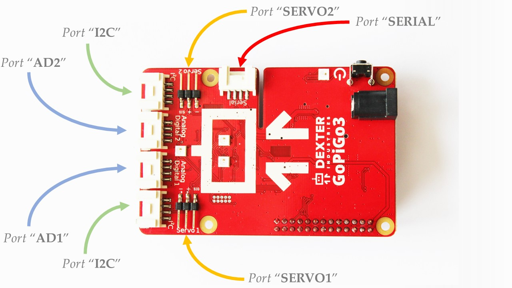

###################
API Reference Point
###################

.. _distance sensor: https://www.dexterindustries.com/shop/distance-sensor/
.. _gopigo3: https://www.dexterindustries.com/shop/gopigo-advanced-starter-kit/
.. _shop: https://www.dexterindustries.com/shop/
.. _infrared receiver: https://www.seeedstudio.com/Grove-Infrared-Receiver-p-994.html
.. _technical specs: https://www.dexterindustries.com/GoPiGo/learning/hardware-port-description/
.. _grove light sensor: https://www.dexterindustries.com/shop/grove-light-sensor/
.. _grove sound sensor: https://www.dexterindustries.com/shop/grove-sound-sensor/
.. _Grove Ultrasonic Sensor: https://www.dexterindustries.com/shop/ultrasonic-sensor/
.. _Grove Buzzer: https://www.dexterindustries.com/shop/grove-buzzer/

.. _physical ports:

**************************
GoPiGo3 Ports
**************************

In this graphical representation, the `GoPiGo3`_ board has the following ports available for use.
The quoted literals are to be used as pin identifiers inside the python scripts.

These ports have the following functionalities:

   * Ports ``"AD1"`` and ``"AD2"`` - general purpose input/output ports.
   * Ports ``"SERVO1"`` and ``"SERVO2"`` - servo controller ports.
   * Ports ``"I2C"`` - ports to which you can connect I2C-enabled devices.
   * Port ``"SERIAL"`` - port to which you can connect UART-enabled device.

.. note::

   Use the quoted port names when referencing them inside a python script like in the following example.

   .. code-block:: python

      # we need an EasyGoPiGo3 object for instantiating sensor / actuator objects
      gpg3_obj = EasyGoPiGo3()

      # we're using the quoted port names from the above graphical representation

      # here's a LightSensor object binded on port AD2
      light_obj = gpg3_obj.init_light_sensor("AD2")

      # here's a UltraSonicSensor object binded on port AD1
      us_obj = gpg3_obj.init_ultrasonic_sensor("AD1")

      # here's a LineFollower object binded on port I2C
      line_follower_obj = gpg3_obj.init_line_follower("I2C")

      # and so on

.. seealso::

   For more technical details on the `GoPiGo3`_ robot, please check our `technical specs`_ page.

**************************
``easygopigo3`` Module
**************************

=====================================
EasyGoPiGo3
=====================================

.. autoclass:: easygopigo3.EasyGoPiGo3
   :members:
   :special-members:

=====================================
DigitalSensor
=====================================

=====================================
AnalogSensor
=====================================

.. autoclass:: easygopigo3.AnalogSensor
   :members:
   :special-members:

=====================================
LightSensor
=====================================

.. autoclass:: easygopigo3.LightSensor
   :members:
   :special-members:

=====================================
SoundSensor
=====================================

.. autoclass:: easygopigo3.SoundSensor
   :members:
   :special-members:

=====================================
UltrasonicSensor
=====================================

.. autoclass:: easygopigo3.UltraSonicSensor
   :members:
   :special-members:

=====================================
Buzzer
=====================================

.. autoclass:: easygopigo3.Buzzer
   :members:
   :special-members:

=====================================
Led
=====================================

=====================================
ButtonSensor
=====================================

=====================================
LineFollower
=====================================

=====================================
Servo
=====================================

=====================================
DistanceSensor
=====================================

=====================================
DHTSensor
=====================================

=====================================
Sensor
=====================================

.. autoclass:: easygopigo3.Sensor
   :members:
   :special-members:
   :exclude-members: __weakref__
