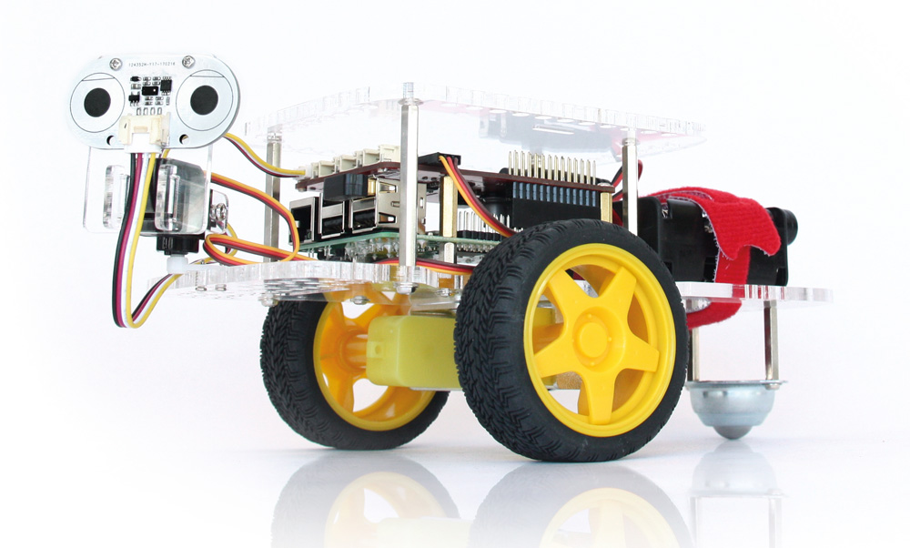

.. _getting-started-chapter:

###############
Getting Started
###############

****************
Buying a GoPiGo3
****************

For buying a `GoPiGo3`_ robot, please head over to our online `shop`_ and search for the `GoPiGo3`_ robot. From our `shop`_, you can get sensors for your robot such as the `Distance Sensor`_, the `Grove Light Sensor`_, etc.

***********************
Assembling GoPiGo3
***********************

For assembling your `GoPiGo3`_ robot, read the instructions from the following page: `assembling instructions`_.

************************
Connecting to GoPiGo3
************************

For connecting to your `GoPiGo3`_ robot with a computer or laptop, read the instructions on the following page: `connecting to robot`_.

***********************
Program your GoPiGo3
***********************

For programming your `GoPiGo3`_ to do anything you want, read the instructions found here: `programming your robot`_.

.. _gopigo3: https://www.dexterindustries.com/shop/gopigo-advanced-starter-kit/
.. _assembling instructions: https://www.dexterindustries.com/GoPiGo/get-started-with-the-gopigo3-raspberry-pi-robot/1-assemble-gopigo3/
.. _connecting to robot: https://www.dexterindustries.com/GoPiGo/get-started-with-the-gopigo3-raspberry-pi-robot/2-connect-to-the-gopigo-3/
.. _programming your robot: https://www.dexterindustries.com/GoPiGo/get-started-with-the-gopigo3-raspberry-pi-robot/3-program-your-raspberry-pi-robot/
.. _shop: https://www.dexterindustries.com/shop/
.. _grove light sensor: https://www.dexterindustries.com/shop/grove-light-sensor/
.. _distance sensor: https://www.dexterindustries.com/shop/distance-sensor/
