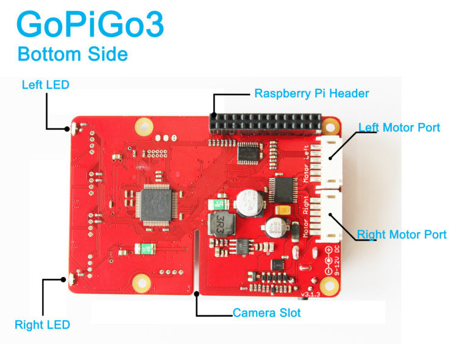

.. _getting-started-chapter:

###############
Getting Started
###############

****************
Buying a GoPiGo3
****************

To buy a `GoPiGo3`_ robot, please head over to our online `shop`_ and search for the `GoPiGo3`_ robot. From our `shop`_, you can get sensors for your robot such as the `Distance Sensor`_, the `Light & Color Sensor`_, etc.

.. image:: images/gopigo3.jpg

*********************************
Getting Familiar with the GoPiGo3
*********************************

The `GoPiGo3`_ offers many connectors and output options, mainly:

* two analog digital ports, known as AD1, and AD2.
* two I2C ports, which are interchangeable.
* two servo connectors.
* one serial port.
* two "eye" leds for the user to program.
* one antenna led to give connection feedback.
* one power led to give power level and boot status feedback.
* one power button to power it on and off.
* one power port to connect the 12V battery pack.
* two motor connectors.

************************
Assembling Your GoPiGo3
************************

To assemble your `GoPiGo3`_ robot, read the instructions from the following page: `assembling instructions`_.

***************************
Connecting to your GoPiGo3
***************************

To connect to your `GoPiGo3`_ robot with a computer or laptop, read the instructions on the following page: `connecting to robot`_.

**************************
Programming your GoPiGo3
**************************

To program your `GoPiGo3`_ to do what you want, you can follow the rest of instructions found in the `Tutorials - Basic`_ section.

To install or update the `GoPiGo3`_ library on your RaspberryPi, open a terminal or the command line and type the following command:

.. code-block:: bash

   # follow any given instructions given through this command

   curl -kL dexterindustries.com/update_gopigo3 | bash

Also, in order to be able to use the :py:meth:`easygopigo3.EasyGoPiGo3.init_distance_sensor` and :py:meth:`easygopigo3.EasyGoPiGo3.init_line_follower` methods, the `DI-Sensors`_ package is required.
You can install it or update it with the following command in the terminal:

.. code-block:: bash

   # follow any given instructions given through this command

   curl -kL dexterindustries.com/update_sensors | bash

***********************
Connecting More Sensors
***********************

The `GoPiGo3`_ can also be paired with our in-house sensors.
There are a number of digital and analog sensors that can be connected to the GoPiGo3.

   * The `Distance Sensor`_.
   * The `Light & Color Sensor`_.
   * The `Temperature Humidity Pressure Sensor`_.
   * The `Line Follower Sensor`_.
   * The `IMU Sensor`_.
   * The `Infrared Receiver`_ and `Infrared Remote`_.
   * The `Raspberry Pi camera`_.

For more on getting started with these sensors, please check the `DI-Sensors`_ documentation.

.. _gopigo3: https://gopigo.io/
.. _assembling instructions: https://gopigo.io/getting-started/
.. _connecting to robot: https://gopigo.io/pairing-gopigo-os/
.. _Tutorials - Basic: tutorials-basic/index.html
.. _shop: https://gopigo.io/shop/
.. _distance sensor: https://gopigo.io/distance-sensor/
.. _light & color sensor: https://gopigo.io/light-and-color-sensor/
.. _grove loudness sensor: https://gopigo.io/grove-loudness-sensor/
.. _grove buzzer: https://gopigo.io/grove-buzzer/
.. _grove led: https://gopigo.io/grove-led-red/
.. _grove button: https://gopigo.io/grove-button/
.. _grove motion sensor: https://gopigo.io/grove-pir-motion-sensor/
.. _servo: https://gopigo.io/servo-package/
.. _line follower sensor: https://gopigo.io/line-follower-for-robots/
.. _infrared receiver: https://gopigo.io/grove-infrared-receiver/
.. _infrared remote: https://gopigo.io/remote-control/
.. _raspbian for robots: https://sourceforge.net/projects/dexterindustriesraspbianflavor/
.. _forum: http://forum.dexterindustries.com/categories
.. _DI-Sensors: http://di-sensors.readthedocs.io
.. _imu sensor: https://gopigo.io/imu-sensor/
.. _temperature humidity pressure sensor: https://gopigo.io/thp-sensor/
.. _Raspberry Pi camera: https://gopigo.io/raspberry-pi-camera/
.. _DI-Sensors: http://di-sensors.readthedocs.io