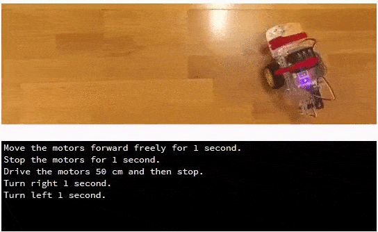
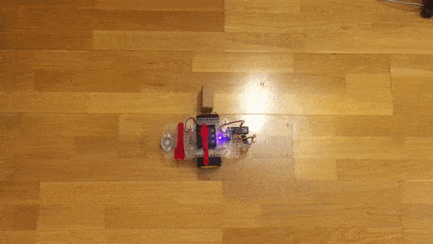
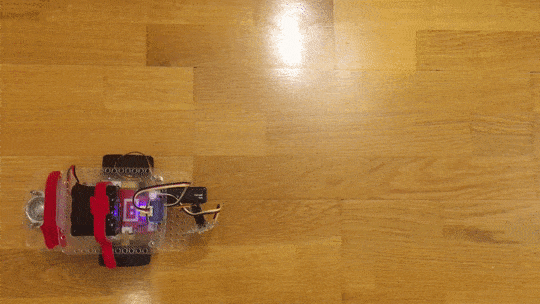

.. _tutorials-basic-driving-chapter:

**************************
Driving Around
**************************

Driving the GoPiGo3 around is only a matter of choosing the right methods from the :py:class:`~easygopigo3.EasyGoPiGo3` class.
In all of our examples, the :py:mod:`~easygopigo3` is required and needs to be imported and a :py:class:`~easygopigo3.EasyGoPiGo3` object
can be instantiated this way:

.. code-block:: python

   from easygopigo3 import EasyGoPiGo3 # importing the EasyGoPiGo3 class
   gpg = EasyGoPiGo3() # instantiating a EasyGoPiGo3 object

Instantiating :py:class:`~easygopigo3.EasyGoPiGo3` object can fail if the GoPiGo3 is not present or there's a firmware mismatch.
Check the :py:class:`~easygopigo3.EasyGoPiGo3.__init__` constructor of this class to see what exceptions can be raised.

=======================
Forward, R/L, Backward
=======================

The most basic commands don't offer control over how much distance the GoPiGo3 travels. They only get called once and then
it's the responsability of the user to stop the GoPiGo3 from moving, regularly by using the :py:meth:`~easygopigo3.EasyGoPiGo3.stop` command.

We first need to import the :py:class:`easygopigo3` and the :py:mod:`python:time` modules and instantiate a EasyGoPiGo3 object.

.. code-block:: python

    # import the time library for the sleep function
    import time
    from easygopigo3 import EasyGoPiGo3

    # create an instance of the GoPiGo3 class.
    # gpg will be the GoPiGo3 object.
    gpg = EasyGoPiGo3()

Next, move the robot forward for exactly one second and right after that continue to the next block of code.

.. code-block:: python

    print("Move the motors forward freely for 1 second.")
    gpg.forward()
    time.sleep(1)
    gpg.stop()

Stop the motors for a second.

.. code-block:: python

    print("Stop the motors for 1 second.")
    time.sleep(1)

And then move forward again, but this time for 50 centimeters and once the moving function ends, wait a second until the next block of code
gets executed. Notice that :py:meth:`~easygopigo3.EasyGoPiGo3.drive_cm` is a blocking function in this case.

.. code-block:: python

    print("Drive the motors 50 cm and then stop.")
    gpg.drive_cm(50, True)
    time.sleep(1)

Then right for a second.

.. code-block:: python

    print("Turn right 1 second.")
    gpg.right()
    time.sleep(1)

And likewise to the left.

.. code-block:: python

    print("Turn left 1 second.")
    gpg.left()
    time.sleep(1)

Finally, stop the robot.

.. code-block:: python

    print("Stop!")
    gpg.stop()
    print("Done!")

If you want to run this by yourself, `here's the script on github <https://github.com/DexterInd/GoPiGo3/blob/master/Software/Python/Examples/easy_Motors.py>`_.

=======================
Describing a Square
=======================

To make the GoPiGo3 describe a square by moving itself, you need to run the following script.
To do this, :py:meth:`~easygopigo3.EasyGoPiGo3.drive_cm` and :py:meth:`~easygopigo3.EasyGoPiGo3.turn_degrees`
methods are required. A square with the side length of 30cm is drawn. The square is drawn clockwise.

.. code-block:: python

   from easygopigo3 import EasyGoPiGo3

   gpg = EasyGoPiGo3()
   length = 30

   for i in range(4):
     gpg.drive_cm(length) # drive forward for length cm
     gpg.turn_degrees(90) # rotate 90 degrees to the right

.. image:: ../images/driving2.gif

=====================
Making Circular Moves
=====================

Driving straight in one direction is one thing, but rotating around a center axis at a specific radius is
something entirely different. In this example, the GoPiGo3 draws half a circle and then returns
on the same track by spinning itself on the spot.

The radius of the circle is set at 50 centimeters and the robot will move for half of the circle (aka 180 degrees).

.. code-block:: python

   from easygopigo3 import EasyGoPiGo3

   gpg = EasyGoPiGo3()

   gpg.orbit(180, 50) # draw half a circle
   gpg.turn_degrees(180) # rotate the GoPiGo3 around
   gpg.orbit(-180, 50) # return on the initial path
   gpg.turn_degrees(180) # and put it in the initial position

.. image:: ../images/driving3.gif

====================
Drawing an *8* Shape
====================

Let's say we want to draw an 8 shape with the GoPiGo3 and at the end have the GoPiGo3 reach the same position
it initially left from.

To do this, we have to use :py:meth:`~easygopigo3.EasyGoPiGo3.orbit` and :py:meth:`~easygopigo3.EasyGoPiGo3.drive_cm` methods.

.. code-block:: python

   from easygopigo3 import EasyGoPiGo3

   gpg = EasyGoPiGo3()
   radius = 30

   gpg.orbit(-270, radius) # to rotate to the left
   gpg.drive_cm(radius * 2) # move forward
   gpg.orbit(270, radius) # to rotate to the right
   gpg.drive_cm(radius * 2) # move forward

=================================
Going Forward at Increasing Speed
=================================

In this example, we make the GoPiGo3 go forward at an ever increasing speed. We start of with a speed of ``50`` and end up going at ``300``.
:py:meth:`~easygopigo3.EasyGoPiGo3.forward`, :py:meth:`~easygopigo3.EasyGoPiGo3.set_speed` and :py:meth:`~easygopigo3.EasyGoPiGo3.stop` methods are used.

.. warning::

   This example will not work with versions released before November 2018. Do an update before running it.

.. code-block:: python

   from easygopigo3 import EasyGoPiGo3
   from time import time, sleep

   gpg = EasyGoPiGo3()

   # setting speed to lowest value and
   # calculating the step increase in speed
   current_speed = 50
   end_speed = 400
   step = (end_speed - current_speed) / 20
   gpg.set_speed(current_speed)

   # start moving the robot at an ever increasing speed
   gpg.forward()
   while current_speed <= end_speed:
     sleep(0.1)
     gpg.set_speed(current_speed)
     current_speed += step

   # and then stop it
   gpg.stop()

==============
Other Examples
==============

There are also other examples you can look at, namely `the projects <https://github.com/DexterInd/GoPiGo3/blob/master/Projects>`_ in the GoPiGo3 repository.
Also, to see all methods for moving around the GoPiGo3, check the :ref:`GoPiGo3 movement API <gopigo3-movement-api-methods>`.
